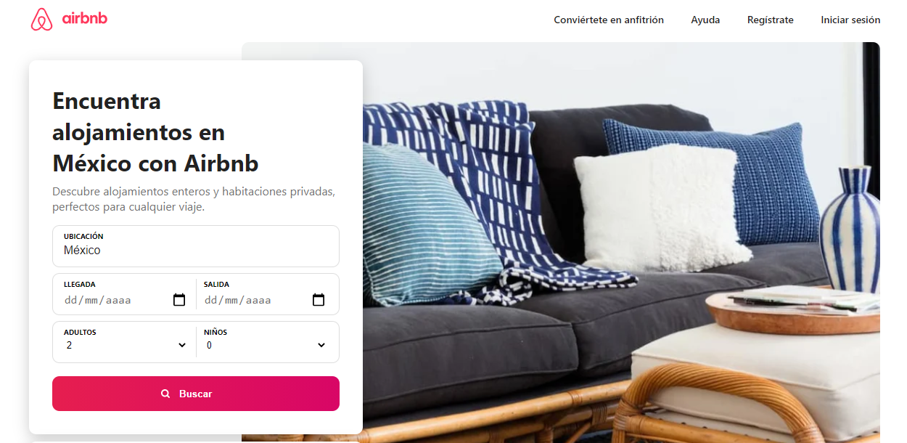
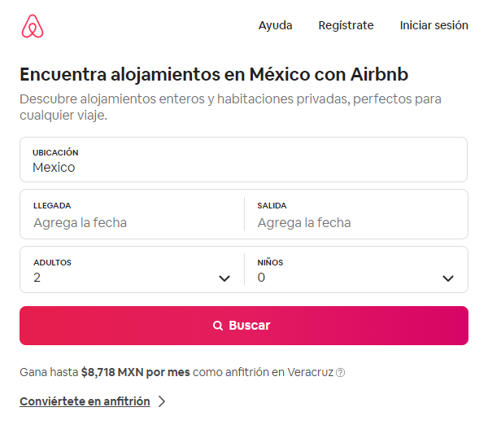
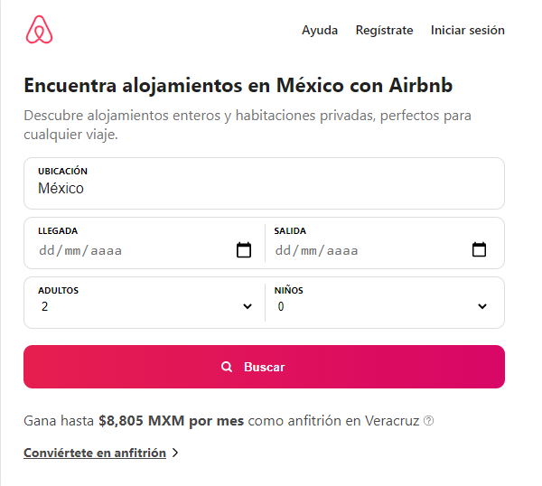

# [airbnb-mx](https://said-alrove.github.io/airbnb-mx/)
Replica of the home page of Airbnb Mexico.

My idea with this project is to replicate the home of the [Airbnb MX](https://es.airbnb.com/a/stays/Mexico?af=43720035&c=.pi0.pk53373632398_388144057392_c_304865403058&sem_position=&sem_target=kwd-304865403058&location_of_interest=&location_physical=1010203&localized_ghost=true&gclid=Cj0KCQjw6ZOIBhDdARIsAMf8YyFWVLMTXbZOk34m5rBDTjYi08TQ_mWjE1zIO085W8AW7a4tHHuHrz8aAtB4EALw_wcB&_set_bev_on_new_domain=1627796593_ZDE0NmIxMDIwODlj) page for practicing my habilities with CSS, and SASS (by modulating the stylesheets with the SMACSS architecture how I've been making it since a few projects ago).

For now, I've only completed the top bar (header and navigation), and the reservation formulary with its respective hero image in the distance, but I'll be adding new parts of the page over time.

## Project's preview

### Desktop

#### Original

#### Replica

### Mobile

#### Original

#### Replica

## Details

Obviously, I didn't get the exact result in contrast to the original page due to there were some things like the fonts that I couldn't approach well enough to get the same typography and some margins and paddings that I didn't get with the same precision as in the original, but out of that, I consider that at least until what I've made ... I've gotten a great result :D.

I'll continue updating this part as long as I update the project with new components...